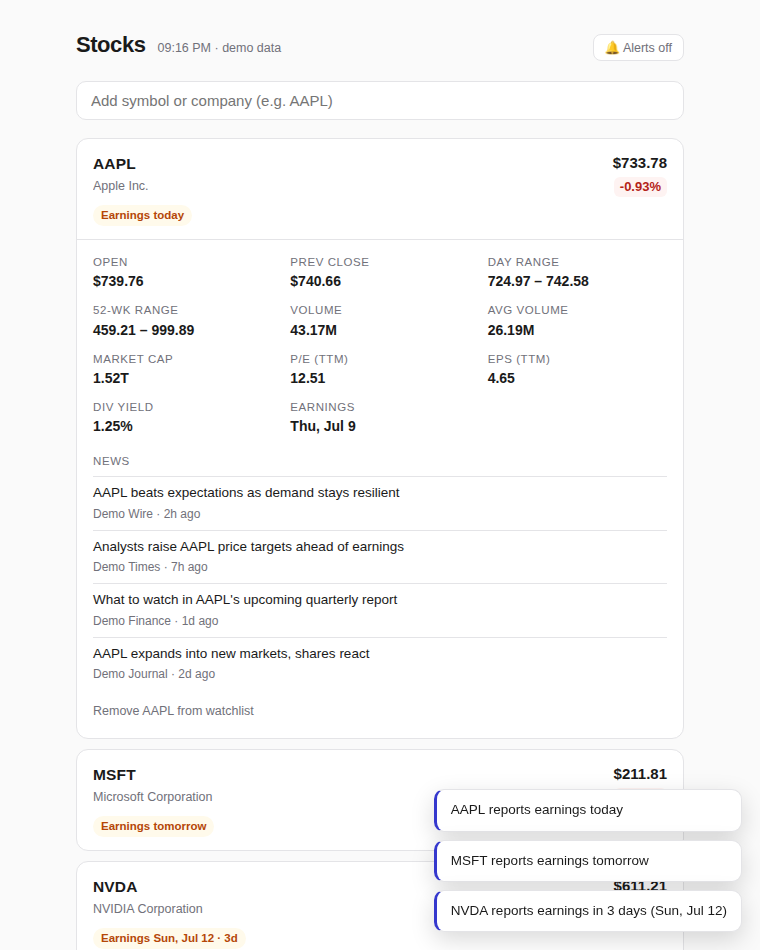

# Stocks — minimalist watchlist with earnings reminders

A small, self-contained stock tracker fed by Yahoo Finance. One Node server,
one page, **zero dependencies**.



## What it does

- **Watchlist** of your favorite tickers (stored in your browser, survives restarts).
- **Vital numbers only**: price, day change, open/prev close, day & 52-week range,
  volume, market cap, P/E, EPS, dividend yield, next earnings date.
- **News**: latest headlines per stock, one click away.
- **Earnings reminders, several times in advance**: you're alerted **7 days,
  3 days, 1 day before, and on the day** of each upcoming earnings report —
  as browser notifications (toggle the 🔔) plus in-app toasts. Each reminder
  fires only once, and if the app was closed during a stage it catches up with
  the closest one instead of spamming you.
- Quotes auto-refresh every minute; dark mode follows your system.

## Run it

Requires Node 18+.

```sh
node server.js
```

Open http://localhost:3000, add your tickers, and click the 🔔 to allow
notifications. Keep the tab open (pinned tabs work great) so reminders can fire.

### Open it on your phone

1. Start the server on your computer (command above) and leave it running.
2. Make sure your phone is on the **same Wi-Fi** as the computer.
3. The server prints an `on your phone: http://192.168.x.x:3000` line at
   startup — type that address into your phone's browser.
4. Optional: use your browser's **Add to Home Screen** (share menu on iPhone,
   ⋮ menu on Android) to get an app icon that opens full-screen.

Heads-up: on the phone you get the full app — live quotes, news, earnings
badges and in-app reminder banners. *System* push notifications are the one
thing phones reserve for HTTPS sites, so for those keep the tab open on your
computer, or put the app behind HTTPS (e.g. a free [Tailscale](https://tailscale.com)
or [ngrok](https://ngrok.com) tunnel, or host it on a service like Render/Fly).

### Demo mode

No network / just want to try it? Synthetic data with earnings staged 0–26
days out, so you can see badges and reminders immediately:

```sh
node server.js --demo
```

## How it talks to Yahoo

The server proxies three public Yahoo Finance endpoints (the browser can't call
them directly because of CORS):

| Purpose | Endpoint |
| --- | --- |
| Quotes + earnings dates | `v7/finance/quote` (with the cookie+crumb handshake Yahoo requires) |
| Fallback quotes | `v8/finance/chart` (no auth; used if the crumb handshake fails) |
| News & symbol search | `v1/finance/search` |

Responses are cached briefly (quotes 30 s, news 5 min) to stay polite.
These are unofficial endpoints — if Yahoo changes them, the fallback keeps
prices flowing even when earnings/valuation fields are unavailable.

## Notes

- Reminders fire while the page is open — there's no push server, by design
  (nothing to sign up for, no data leaves your machine).
- Watchlist and alert history live in `localStorage`; the server is stateless.
